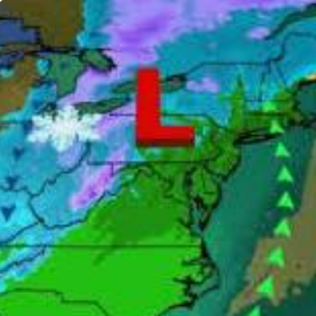
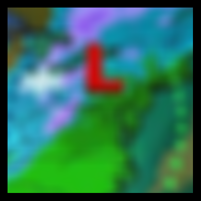

# Convolving an image with a gaussian kernel.
The image `source.png` that we will be blurring.




To run the program and generate the blurred image for yourself, run the following command:
```bash	
cargo run -- 11 30
```
`11(x11)` is the kernel size, `30` is the standard deviation of the gaussian kernel.


Naïvely convolving the image (`n x n`) with the kernel $K$ (`k x k`) is O( `k` $^2$ $\cdot$ `n` $^2$). Using the fact that the gaussian kernel $K$ is separable ($\exists g \in \mathbb{R}^k: gg^\intercal = K$), we can convolve first with $g$ and then with $g^\intercal$. This reduces the complexity to O( 2`k` $\cdot$ `n` $^2$).

The program times the two approaches:
```
convolved naive_quadratic  = 0.9480615s
convolved naive_decomposed = 0.0800129s
``````
The decomposed approach is indeed faster.

Below are, respectively, the blurred image using the decomposed approach and the blurred image using the naïve approach. They should look equal because they are equal up to floating point errors.


